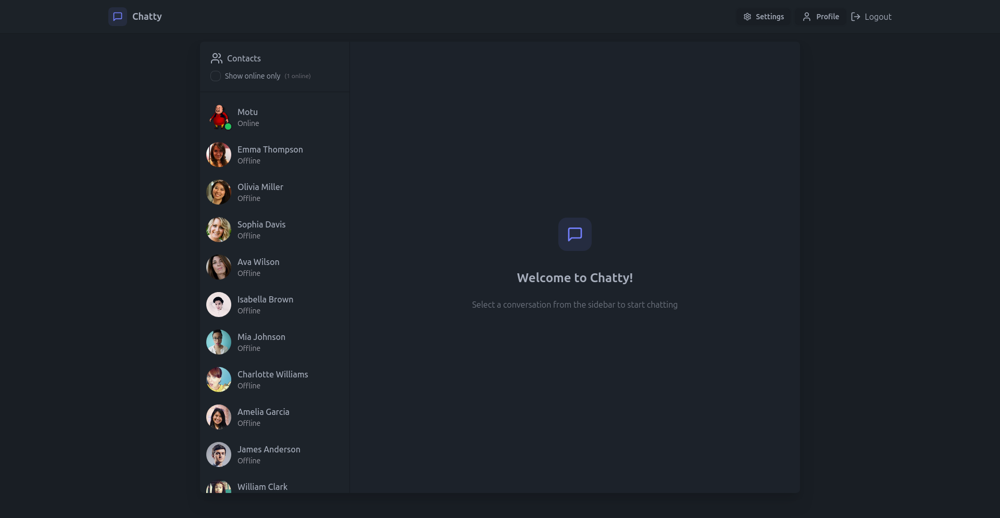

# 💬 Real-Time Chat Application



## 🌐 Live Demo
[Chat Application](https://realtime-chatapp-l463.onrender.com/)

## 🎯 About
A full-stack real-time chat application built with MERN stack and Socket.IO. Features include real-time messaging, image sharing, and online status tracking.

## ⚡ Key Features
- Real-time messaging using Socket.IO
- Image sharing with Cloudinary
- User authentication & authorization
- Online/Offline user status
- Responsive design with Tailwind CSS
- Profile customization

## 🛠️ Tech Stack
- MongoDB (Database)
- Express.js (Backend)
- React.js (Frontend)
- Node.js (Runtime)
- Socket.IO (Real-time)
- Cloudinary (Image hosting)
- TailwindCSS & DaisyUI (Styling)
- JWT (Authentication)

## 📦 Installation

1. Clone repository
```bash
git clone https://github.com/vishalyadavaas/RealTime-ChatApp.git

cd realtime-chat
```
2. Install dependencies
```bash
# Frontend dependencies
cd frontend
npm install

# Backend dependencies
cd ../backend
npm install
```
3. Environment Setup
```bash
# Create .env in backend directory
cd backend
touch .env

# Add following variables to .env
PORT=4000
MONGO_URI=your_mongodb_uri
JWT_SECRET=your_jwt_secret
CLOUDINARY_CLOUD_NAME=your_cloud_name
CLOUDINARY_API_KEY=your_api_key
CLOUDINARY_API_SECRET=your_api_secret
NODE_ENV=development
```
4. Start Development Servers
```bash
# Terminal 1 - Frontend
cd frontend
npm run dev

# Terminal 2 - Backend
cd backend
npm run dev
```
Visit http://localhost:5173 to view the application